# diffSOD
## Multi-modal Salient Object Detection via a Unified Diffusion Model


## 🪧 [Comprehensive supplements](https://github.com/QuantumScriptHub/diffSOD/blob/master/result/ACM_MM_2024_SUPP.pdf)
For a more comprehensive and detailed visual demonstration, please refer to our extensive [supplementary materials](https://github.com/QuantumScriptHub/diffSOD/blob/master/result/ACM_MM_2024_SUPP.pdf). Therein, you will find the theoretical derivation and formulaic proof for the Attention Feature Interaction Module (AFIM), as well as additional implementation details and comparative experimental data.

##  📢 Overview
<p align="justify">
Salient Object Detection (SOD) aims to identify and segment the most attention-grabbing elements within an image. SOD methods can be differentiated into several types according to the input data, such as RGB, RGB-D (Depth), and RGB-T (Thermal). Previous research primarily focused on saliency detection for single data types. However, forcing an RGB-D SOD model to process RGB-T data will degrade its performance significantly. In addition, current methods still face challenges in detecting fine edge details of salient objects and achieving end-to-end training. To mitigate these issues, we propose a novel model framework, diffSOD, which applies diffusion models for saliency detection by transforming SOD into a denoising process from a noisy mask to an object mask. It offers a unified solution for SOD across three types of data: RGB, RGB-D and RGB-T. Specifically, in diffSOD, the RGB image and the corresponding depth map (thermal map, RGB image) are first separately processed by two parallel Res2Net backbones. Secondly, the RGB features and depth features (thermal features, RGB features) are fed into an Attention Feature Interaction Module (AFIM) to obtain interaction features. Then, the object mask diffuses from ground truth to a random distribution in the latent space. The model learns to reverse this noising process guided by the semantic features and interaction features via the cross-attention mechanism. Finally, as the noisy mask is gradually denoised, the object mask can be reconstructed. Extensive experiments demonstrate that the proposed diffSOD model efficiently detects salient objects in RGB, RGB-D, and RGB-T data, achieving superior performance compared to previous methods.
</p>

<div style="display:flex; justify-content:space-between;">
    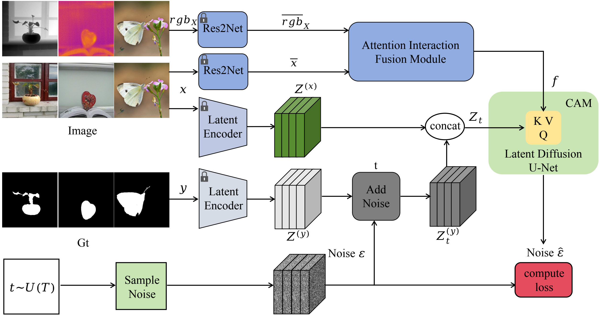
    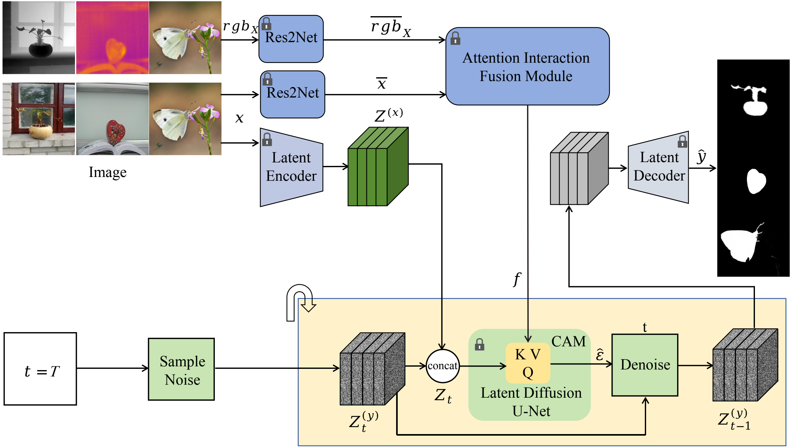
</div>

The left image shows the training process, while the right one illustrates the inference process.
##  🚀 Modest surprise

<!-- 
<p align="center" style="margin: 0; padding: 0;">
    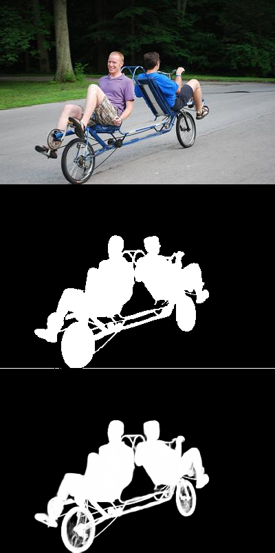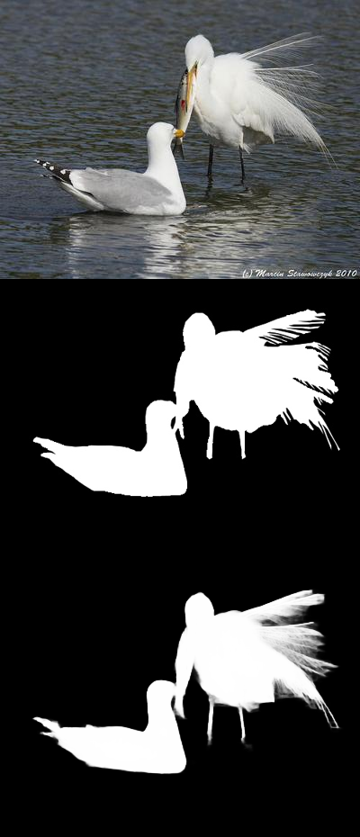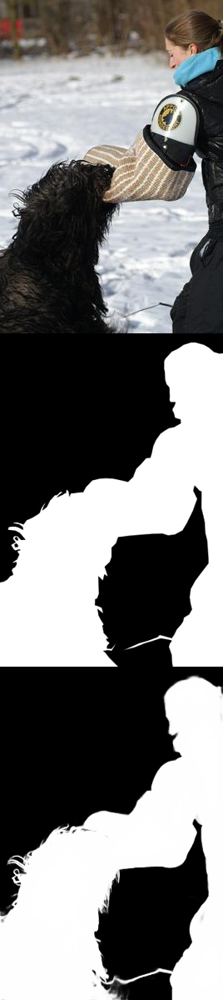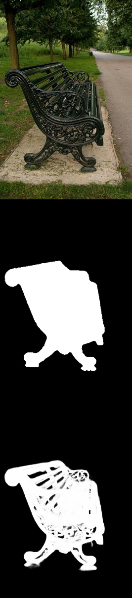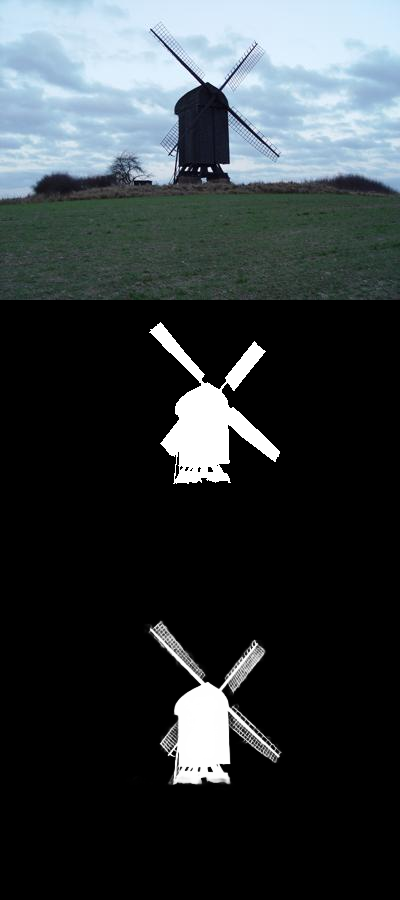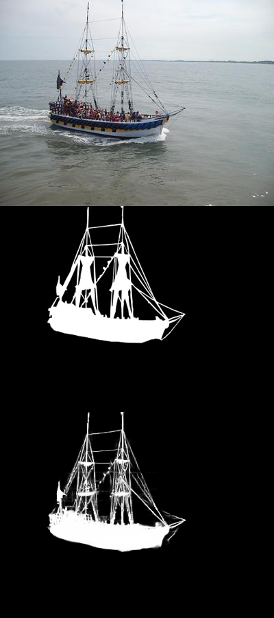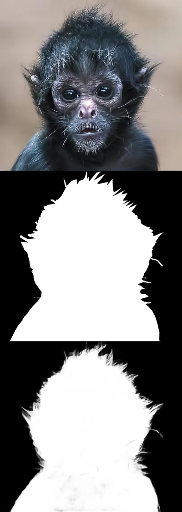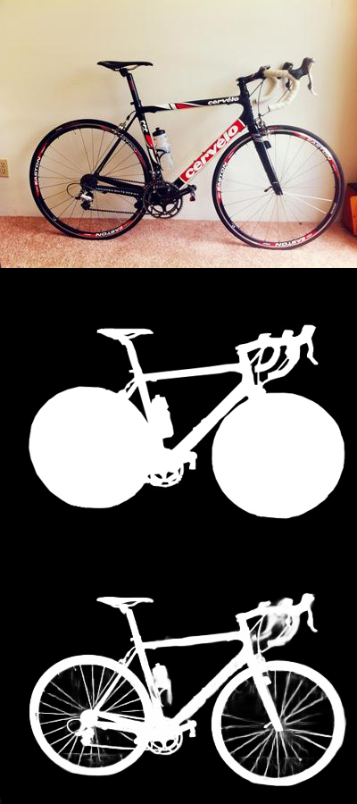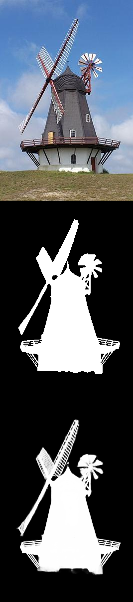
</p>
-->

<p align="justify">
We present diffSOD, a diffusion model and associated fine-tuning protocol for Salient Object Detection(SOD). Its core principle is to leverage the rich visual knowledge stored in modern generative image models. The first line represents the input image, the second line is its corresponding ground-truth mask, and the third line shows the saliency mask generated by our diffSOD model. It can be observed that even though our model is trained on somewhat coarse SOD benchmark datasets, it is still capable of accurately segmenting the edges of salient objects, benefiting from powerful visual priors. The final salient object detection results are even finer and more accurate than the ground-truth mask. 
</p> 

More results can be viewed by clicking on [result](./result).

<!-- 
<p align="center">
    
</p>
-->

<p align="justify">
We  propose the innovative model framework (diffSOD) that provides a unified solution for the salient object detection task of three types of data (RGB, RGB-D, and RGB-T). The three types of data can be handled in one model (all in one) with the same weight parameters. In this framework, the three types of data are concatenated in an ordered manner within a single input batch, which can detect any RGB, RGB-D, and RGB-T data.  
Our model, derived from Stable Diffusion and fine-tuned with SOD benchmark data, can zero-shot transfer to unseen datasets, offering state-of-the-art salient Object detection results. Benefiting from this feature, we conducted inference on the COCO dataset, which has never been used for saliency detection before, and generated finely detailed saliency object masks. The first line represents the input image, and the second line shows the generated saliency object mask. 
</p>

## ⬇ Datasets
**All datasets are available in public**.
* Download the DUTS-TR and DUTS-TE from [Here](http://saliencydetection.net/duts/#org3aad434)
* Download the DUT-OMRON from [Here](http://saliencydetection.net/dut-omron/#org96c3bab)
* Download the HKU-IS from [Here](https://i.cs.hku.hk/~yzyu/research/deep_saliency.html)
* Download the ECSSD from [Here](https://www.cse.cuhk.edu.hk/leojia/projects/hsaliency/dataset.html)
* Download the PASCAL-S from [Here](http://cbs.ic.gatech.edu/salobj/)
* Download the LFSD from [Here](https://www.eecis.udel.edu/~nianyi/LFSD.htm)
* Download the NJUD from [Here](https://pan.baidu.com/s/1o-kOaDVqjV_druBHjD3NAA)
* Download the NLPR from [Here](https://pan.baidu.com/s/1pocKI_KEvqWgsB16pzO6Yw)
* Download the DUTLF from [Here](https://pan.baidu.com/s/1mhHAXLgoqqLQIb6r-k-hbA)
* Download the SIP from [Here](https://pan.baidu.com/s/14VjtMBn0_bQDRB0gMPznoA)
* Download the VT5000 from [Here](https://pan.baidu.com/s/196S1GcnI56Vn6fLO3oXb5Q) with password:y9jj
* Download the VT821 from [Here](https://drive.google.com/file/d/0B4fH4G1f-jjNR3NtQUkwWjFFREk/view?resourcekey=0-Kgoo3x0YJW83oNSHm5-LEw)
* Download the VT1000 from [Here](https://drive.google.com/file/d/1NCPFNeiy1n6uY74L0FDInN27p6N_VCSd/view)
  
## 🛠️  Dependencies
```bash
* Python >= 3.8.x
* Pytorch >= 2.0.1
* diffusers >= 0.25.1
* pip install -r requirements.txt
```
## 📦 Checkpoint cache

By default, our [checkpoint](https://drive.google.com/file/d/1bfnhDv6KKCJrsIy6DBj_41CMIt9EFxlG/view?usp=sharing) and [Res2Net backbone](https://drive.google.com/file/d/1aNRStCeNGLVE8x1z-cxNa42f2u0-AvZI/view?usp=sharing) are stored in Google Drive.
You can click the link to download them and proceed directly with inference.

## ⚙ Configurations

#### Training

- --pretrained_model_name_or_path : [Pretrained model](https://huggingface.co/stabilityai/stable-diffusion-2/tree/main) path for stable-diffusion-2 from hugging face, you need to download it and place it in a local directory.
- --train_img_list : img_list.txt, including the absolute path of all train images.
- --train_x_list : x_list.txt, it is a list of absolute paths, including the corresponding depth maps, thermal maps, and original images of the input images.
- --train_gt_list : gt_list.txt, including the absolute path of all ground truth masks.  
- --val_img : Path of the validation set of images.
- --val_x :  Path of the validation set of the corresponding depth maps, thermal maps, and original images of the input images.
- --val_gt : Path of the validation set of ground truth masks.

Regarding the pre-trained weights of Res2Net, we have already loaded them in the Res2Net_v1b.py under the lib folder. By running the train.sh script, you can automatically download the pre-trained weights and start training.

#### Inference 

- --input_rgb_path : The local path of the image to be inferred.
- --input_x_path : The corresponding depth maps, thermal maps, and original images of the input images.
- --output_dir : The output path of the image after inference.
- --stable_diffusion_repo_path : [Pretrained model](https://huggingface.co/stabilityai/stable-diffusion-2/tree/main) path for stable-diffusion-2 from hugging face, you need to download it and place it in a local directory.
- --pretrained_model_path : The path of the best checkpoint saved by the model you trained，you can also use the [checkpoint](https://drive.google.com/file/d/1bfnhDv6KKCJrsIy6DBj_41CMIt9EFxlG/view?usp=sharing) we trained, load them into a local path, and proceed with inference directly.
- --res2net_model_path :  [The Res2Net backbone model](https://drive.google.com/file/d/1aNRStCeNGLVE8x1z-cxNa42f2u0-AvZI/view?usp=drive_link) we have trained, you need to download it and place it in the corresponding local path. Or you can also load the path of the Res2Net weights you have trained here.

The default settings are optimized for the best result. However, the behavior of the code can be customized:
- Trade-offs between the **accuracy** and **speed** (for both options, larger values result in better accuracy at the cost of slower inference.)
  - `--ensemble_size`: Number of inference passes in the ensemble. Default: 10.
  - `--denoise_steps`: Number of denoising steps of each inference pass. Default: 10.
- `--half_precision`: Run with half-precision (16-bit float) to reduce VRAM usage, might lead to suboptimal result.
- By default, the inference script resizes input images to the *processing resolution*, and then resizes the prediction back to the original resolution. This gives the best quality, as Stable Diffusion, from which diffSOD is derived, performs best at 384x384 resolution.  
  - `--processing_res`: the processing resolution; set 0 to process the input resolution directly. Default: 384.
  - `--output_processing_res`: produce output at the processing resolution instead of upsampling it to the input resolution. Default: False.
- `--seed`: Random seed can be set to ensure additional reproducibility. Default: None (using current time as random seed).
- `--batch_size`: Batch size of repeated inference. Default: 0 (best value determined automatically).

## 💻 Testing on your images
### 📷 Prepare images
If you have images at hand, skip this step. Otherwise, download a few images from [Here](http://saliencydetection.net/duts/download/DUTS-TE.zip).
### 🎮 Training and  Inference
Run **train.sh** and **inference.sh** scripts for  training and  inference.
```bash
git clone https://github.com/QuantumScriptHub/diffSOD.git
cd scripts
bash train.sh

cd scripts
bash inference.sh
```

## 🎫 License

This work is licensed under the Apache License, Version 2.0 (as defined in the [LICENSE](LICENSE.txt)).

By downloading and using the code and model you agree to the terms in the  [LICENSE](LICENSE.txt).

[](https://www.apache.org/licenses/LICENSE-2.0)


